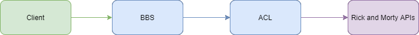

# rick-and-morty-api
Este es una aplicación que llama a las APIs de Rick and Morty y genera un nuevo objeto como respuesta. 

## Componentes

El microservicio posee 2 componentes, pensando en una implementación en docker, el primero corresponde al BBS maneja la lógica del microservicio y es el que recibe las peticiones desde el cliente, mientras que el ACL se comunica con las APIs de [Rick and Morty](https://rickandmortyapi.com/). Dicho de otra manera, el cliente se comunica con el **BBS**, quien posee la logica de la estructura y hace la llamada al **ACL**, que a su vez realiza las llamadas directamente a las APIs.  




## Exposicion

| Method | URI | Parametros | Observacion |
| ------------- | ------------- | ------------- | ------------- |
| GET | /rick-and-morty/v1/challenge/ | id | Id de tipo numérico y que viaja como parámetro en la URI |

Estructura del response: 

```json 
{
    "$schema": "http://json-schema.org/draft-07/schema",
    "$id": "http://example.com/example.json",
    "type": "object",
    "required": [
        "id",
        "name",
        "status",
        "species",
        "type",
        "episode_count",
        "origin"
    ],
    "properties": {
        "id": {
            "$id": "#/properties/id",
            "type": "int"
        },
        "name": {
            "$id": "#/properties/name",
            "type": "string"
        },
        "status": {
            "$id": "#/properties/status",
            "type": "string"
        },
        "species": {
            "$id": "#/properties/species",
            "type": "string"
        },
        "type": {
            "$id": "#/properties/type",
            "type": "string"
        },
        "episode_count": {
            "$id": "#/properties/episode_count",
            "type": "int"
        },
        "origin": {
            "$id": "#/properties/origin",
            "type": "object",
            "required": [
                "name",
                "url",
                "dimension",
                "residents"
            ],
            "properties": {
                "name": {
                    "$id": "#/properties/origin/properties/name",
                    "type": "string"
                },
                "url": {
                    "$id": "#/properties/origin/properties/url",
                    "type": "string"
                },
                "dimension": {
                    "$id": "#/properties/origin/properties/dimension",
                    "type": "string"
                },
                "residents": {
                    "$id": "#/properties/origin/properties/residents",
                    "type": "array",
                    "items": {
                        "$id": "#/properties/origin/properties/residents/items",
                        "type": "string"
                    }
                }
            }
        }
    }
}
```

## Swagger

La documentación auto generada, queda expuesta al iniciar la aplicación BBS en la ruta [http://localhost:8080/swagger-ui.html](http://localhost:8080/swagger-ui.html).
